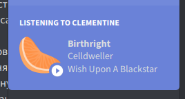

# MPRIS player plugin for [DiscordQt](https://github.com/ruslang02/discord-qt)

Fetches currently playing music in the system using DBus MPRIS interface and streams it into Discord's Rich Presence.

**Available only on Linux!**

**This is not a BetterDiscord plugin, it is designed to work with [DiscordQt](https://github.com/ruslang02/discord-qt)!**



## Install from releases

Download the package from [here](https://github.com/ruslang02/mpris-dqt-plugin/releases/latest) and unpack as a folder at `~/.config/discord-qt/plugins`.

## Build

```bash
cd ~/.config/discord-qt/plugins
git clone https://github.com/ruslang02/mpris-dqt-plugin && cd mpris-dqt-plugin
npm install
npm run build
```

Restart your DiscordQt client and the plugin will load automatically.

## Supported players

 - Clementine

## License
GPL 3.0

## Third-party
 - [discord.js](https://github.com/discordjs/discord.js)
 - [discord-rpc](https://github.com/discordjs/RPC)
 - [dbus-next](https://github.com/dbusjs/node-dbus-next)
